Curitiba\_156
================
Marcos Abreu
7/14/2020

## Amostra dos dados

<!--html_preserve-->

<style>html {
  font-family: -apple-system, BlinkMacSystemFont, 'Segoe UI', Roboto, Oxygen, Ubuntu, Cantarell, 'Helvetica Neue', 'Fira Sans', 'Droid Sans', Arial, sans-serif;
}

#fhqeswqswu .gt_table {
  display: table;
  border-collapse: collapse;
  margin-left: auto;
  margin-right: auto;
  color: #333333;
  font-size: 16px;
  background-color: #FFFFFF;
  width: auto;
  border-top-style: solid;
  border-top-width: 2px;
  border-top-color: #A8A8A8;
  border-right-style: none;
  border-right-width: 2px;
  border-right-color: #D3D3D3;
  border-bottom-style: solid;
  border-bottom-width: 2px;
  border-bottom-color: #A8A8A8;
  border-left-style: none;
  border-left-width: 2px;
  border-left-color: #D3D3D3;
}

#fhqeswqswu .gt_heading {
  background-color: #FFFFFF;
  text-align: center;
  border-bottom-color: #FFFFFF;
  border-left-style: none;
  border-left-width: 1px;
  border-left-color: #D3D3D3;
  border-right-style: none;
  border-right-width: 1px;
  border-right-color: #D3D3D3;
}

#fhqeswqswu .gt_title {
  color: #333333;
  font-size: 125%;
  font-weight: initial;
  padding-top: 4px;
  padding-bottom: 4px;
  border-bottom-color: #FFFFFF;
  border-bottom-width: 0;
}

#fhqeswqswu .gt_subtitle {
  color: #333333;
  font-size: 85%;
  font-weight: initial;
  padding-top: 0;
  padding-bottom: 4px;
  border-top-color: #FFFFFF;
  border-top-width: 0;
}

#fhqeswqswu .gt_bottom_border {
  border-bottom-style: solid;
  border-bottom-width: 2px;
  border-bottom-color: #D3D3D3;
}

#fhqeswqswu .gt_col_headings {
  border-top-style: solid;
  border-top-width: 2px;
  border-top-color: #D3D3D3;
  border-bottom-style: solid;
  border-bottom-width: 2px;
  border-bottom-color: #D3D3D3;
  border-left-style: none;
  border-left-width: 1px;
  border-left-color: #D3D3D3;
  border-right-style: none;
  border-right-width: 1px;
  border-right-color: #D3D3D3;
}

#fhqeswqswu .gt_col_heading {
  color: #333333;
  background-color: #FFFFFF;
  font-size: 100%;
  font-weight: normal;
  text-transform: inherit;
  border-left-style: none;
  border-left-width: 1px;
  border-left-color: #D3D3D3;
  border-right-style: none;
  border-right-width: 1px;
  border-right-color: #D3D3D3;
  vertical-align: bottom;
  padding-top: 5px;
  padding-bottom: 6px;
  padding-left: 5px;
  padding-right: 5px;
  overflow-x: hidden;
}

#fhqeswqswu .gt_column_spanner_outer {
  color: #333333;
  background-color: #FFFFFF;
  font-size: 100%;
  font-weight: normal;
  text-transform: inherit;
  padding-top: 0;
  padding-bottom: 0;
  padding-left: 4px;
  padding-right: 4px;
}

#fhqeswqswu .gt_column_spanner_outer:first-child {
  padding-left: 0;
}

#fhqeswqswu .gt_column_spanner_outer:last-child {
  padding-right: 0;
}

#fhqeswqswu .gt_column_spanner {
  border-bottom-style: solid;
  border-bottom-width: 2px;
  border-bottom-color: #D3D3D3;
  vertical-align: bottom;
  padding-top: 5px;
  padding-bottom: 6px;
  overflow-x: hidden;
  display: inline-block;
  width: 100%;
}

#fhqeswqswu .gt_group_heading {
  padding: 8px;
  color: #333333;
  background-color: #FFFFFF;
  font-size: 100%;
  font-weight: initial;
  text-transform: inherit;
  border-top-style: solid;
  border-top-width: 2px;
  border-top-color: #D3D3D3;
  border-bottom-style: solid;
  border-bottom-width: 2px;
  border-bottom-color: #D3D3D3;
  border-left-style: none;
  border-left-width: 1px;
  border-left-color: #D3D3D3;
  border-right-style: none;
  border-right-width: 1px;
  border-right-color: #D3D3D3;
  vertical-align: middle;
}

#fhqeswqswu .gt_empty_group_heading {
  padding: 0.5px;
  color: #333333;
  background-color: #FFFFFF;
  font-size: 100%;
  font-weight: initial;
  border-top-style: solid;
  border-top-width: 2px;
  border-top-color: #D3D3D3;
  border-bottom-style: solid;
  border-bottom-width: 2px;
  border-bottom-color: #D3D3D3;
  vertical-align: middle;
}

#fhqeswqswu .gt_from_md > :first-child {
  margin-top: 0;
}

#fhqeswqswu .gt_from_md > :last-child {
  margin-bottom: 0;
}

#fhqeswqswu .gt_row {
  padding-top: 8px;
  padding-bottom: 8px;
  padding-left: 5px;
  padding-right: 5px;
  margin: 10px;
  border-top-style: solid;
  border-top-width: 1px;
  border-top-color: #D3D3D3;
  border-left-style: none;
  border-left-width: 1px;
  border-left-color: #D3D3D3;
  border-right-style: none;
  border-right-width: 1px;
  border-right-color: #D3D3D3;
  vertical-align: middle;
  overflow-x: hidden;
}

#fhqeswqswu .gt_stub {
  color: #333333;
  background-color: #FFFFFF;
  font-size: 100%;
  font-weight: initial;
  text-transform: inherit;
  border-right-style: solid;
  border-right-width: 2px;
  border-right-color: #D3D3D3;
  padding-left: 12px;
}

#fhqeswqswu .gt_summary_row {
  color: #333333;
  background-color: #FFFFFF;
  text-transform: inherit;
  padding-top: 8px;
  padding-bottom: 8px;
  padding-left: 5px;
  padding-right: 5px;
}

#fhqeswqswu .gt_first_summary_row {
  padding-top: 8px;
  padding-bottom: 8px;
  padding-left: 5px;
  padding-right: 5px;
  border-top-style: solid;
  border-top-width: 2px;
  border-top-color: #D3D3D3;
}

#fhqeswqswu .gt_grand_summary_row {
  color: #333333;
  background-color: #FFFFFF;
  text-transform: inherit;
  padding-top: 8px;
  padding-bottom: 8px;
  padding-left: 5px;
  padding-right: 5px;
}

#fhqeswqswu .gt_first_grand_summary_row {
  padding-top: 8px;
  padding-bottom: 8px;
  padding-left: 5px;
  padding-right: 5px;
  border-top-style: double;
  border-top-width: 6px;
  border-top-color: #D3D3D3;
}

#fhqeswqswu .gt_striped {
  background-color: rgba(128, 128, 128, 0.05);
}

#fhqeswqswu .gt_table_body {
  border-top-style: solid;
  border-top-width: 2px;
  border-top-color: #D3D3D3;
  border-bottom-style: solid;
  border-bottom-width: 2px;
  border-bottom-color: #D3D3D3;
}

#fhqeswqswu .gt_footnotes {
  color: #333333;
  background-color: #FFFFFF;
  border-bottom-style: none;
  border-bottom-width: 2px;
  border-bottom-color: #D3D3D3;
  border-left-style: none;
  border-left-width: 2px;
  border-left-color: #D3D3D3;
  border-right-style: none;
  border-right-width: 2px;
  border-right-color: #D3D3D3;
}

#fhqeswqswu .gt_footnote {
  margin: 0px;
  font-size: 90%;
  padding: 4px;
}

#fhqeswqswu .gt_sourcenotes {
  color: #333333;
  background-color: #FFFFFF;
  border-bottom-style: none;
  border-bottom-width: 2px;
  border-bottom-color: #D3D3D3;
  border-left-style: none;
  border-left-width: 2px;
  border-left-color: #D3D3D3;
  border-right-style: none;
  border-right-width: 2px;
  border-right-color: #D3D3D3;
}

#fhqeswqswu .gt_sourcenote {
  font-size: 90%;
  padding: 4px;
}

#fhqeswqswu .gt_left {
  text-align: left;
}

#fhqeswqswu .gt_center {
  text-align: center;
}

#fhqeswqswu .gt_right {
  text-align: right;
  font-variant-numeric: tabular-nums;
}

#fhqeswqswu .gt_font_normal {
  font-weight: normal;
}

#fhqeswqswu .gt_font_bold {
  font-weight: bold;
}

#fhqeswqswu .gt_font_italic {
  font-style: italic;
}

#fhqeswqswu .gt_super {
  font-size: 65%;
}

#fhqeswqswu .gt_footnote_marks {
  font-style: italic;
  font-size: 65%;
}
</style>

<div id="fhqeswqswu" style="overflow-x:auto;overflow-y:auto;width:auto;height:auto;">

<table class="gt_table">

<thead class="gt_header">

<tr>

<th colspan="6" class="gt_heading gt_title gt_font_normal" style>

Curitiba 156

</th>

</tr>

<tr>

<th colspan="6" class="gt_heading gt_subtitle gt_font_normal gt_bottom_border" style>

Amostra dos dados

</th>

</tr>

</thead>

<thead class="gt_col_headings">

<tr>

<th class="gt_col_heading gt_columns_bottom_border gt_right" rowspan="1" colspan="1">

solicitacao

</th>

<th class="gt_col_heading gt_columns_bottom_border gt_center" rowspan="1" colspan="1">

tipo

</th>

<th class="gt_col_heading gt_columns_bottom_border gt_center" rowspan="1" colspan="1">

orgao\_resp

</th>

<th class="gt_col_heading gt_columns_bottom_border gt_left" rowspan="1" colspan="1">

data

</th>

<th class="gt_col_heading gt_columns_bottom_border gt_center" rowspan="1" colspan="1">

assunto

</th>

<th class="gt_col_heading gt_columns_bottom_border gt_center" rowspan="1" colspan="1">

regional\_ass

</th>

</tr>

</thead>

<tbody class="gt_table_body">

<tr>

<td class="gt_row gt_right" style="font-size: 1;">

7.924.913

</td>

<td class="gt_row gt_center" style="font-size: 1;">

SOLICITAÇÃO

</td>

<td class="gt_row gt_center" style="font-size: 1;">

S. M. DE TRÂNSITO

</td>

<td class="gt_row gt_left" style="font-size: 1;">

2019-07-14

</td>

<td class="gt_row gt_center" style="font-size: 1;">

SEMÁFORO

</td>

<td class="gt_row gt_center" style="font-size: 1;">

UR Pinheirinho

</td>

</tr>

<tr>

<td class="gt_row gt_right" style="font-size: 1;">

7.365.057

</td>

<td class="gt_row gt_center" style="font-size: 1;">

SOLICITAÇÃO

</td>

<td class="gt_row gt_center" style="font-size: 1;">

S. M. DO MEIO AMBIENTE

</td>

<td class="gt_row gt_left" style="font-size: 1;">

2018-06-05

</td>

<td class="gt_row gt_center" style="font-size: 1;">

COLETA

</td>

<td class="gt_row gt_center" style="font-size: 1;">

UR Matriz

</td>

</tr>

<tr>

<td class="gt_row gt_right" style="font-size: 1;">

7.440.474

</td>

<td class="gt_row gt_center" style="font-size: 1;">

SOLICITAÇÃO

</td>

<td class="gt_row gt_center" style="font-size: 1;">

S. M. DO MEIO AMBIENTE

</td>

<td class="gt_row gt_left" style="font-size: 1;">

2018-08-08

</td>

<td class="gt_row gt_center" style="font-size: 1;">

COLETA

</td>

<td class="gt_row gt_center" style="font-size: 1;">

UR CIC

</td>

</tr>

<tr>

<td class="gt_row gt_right" style="font-size: 1;">

7.796.823

</td>

<td class="gt_row gt_center" style="font-size: 1;">

SOLICITAÇÃO

</td>

<td class="gt_row gt_center" style="font-size: 1;">

S. M. DE OBRAS PÚBLICAS

</td>

<td class="gt_row gt_left" style="font-size: 1;">

2019-04-22

</td>

<td class="gt_row gt_center" style="font-size: 1;">

ILUMINAÇÃO PÚBLICA - VIA PÚBLICA

</td>

<td class="gt_row gt_center" style="font-size: 1;">

UR Boa Vista

</td>

</tr>

<tr>

<td class="gt_row gt_right" style="font-size: 1;">

7.866.085

</td>

<td class="gt_row gt_center" style="font-size: 1;">

SOLICITAÇÃO

</td>

<td class="gt_row gt_center" style="font-size: 1;">

S. M. DE OBRAS PÚBLICAS

</td>

<td class="gt_row gt_left" style="font-size: 1;">

2019-06-05

</td>

<td class="gt_row gt_center" style="font-size: 1;">

ILUMINAÇÃO PÚBLICA - VIA PÚBLICA

</td>

<td class="gt_row gt_center" style="font-size: 1;">

UR Portao

</td>

</tr>

<tr>

<td class="gt_row gt_right" style="font-size: 1;">

8.136.758

</td>

<td class="gt_row gt_center" style="font-size: 1;">

SOLICITAÇÃO

</td>

<td class="gt_row gt_center" style="font-size: 1;">

S. M. DO ABASTECIMENTO

</td>

<td class="gt_row gt_left" style="font-size: 1;">

2019-11-28

</td>

<td class="gt_row gt_center" style="font-size: 1;">

ARMAZÉM DA FAMÍLIA

</td>

<td class="gt_row gt_center" style="font-size: 1;">

UR CIC

</td>

</tr>

<tr>

<td class="gt_row gt_right" style="font-size: 1;">

8.288.551

</td>

<td class="gt_row gt_center" style="font-size: 1;">

SOLICITAÇÃO

</td>

<td class="gt_row gt_center" style="font-size: 1;">

S. M. DA SAÚDE

</td>

<td class="gt_row gt_left" style="font-size: 1;">

2020-03-02

</td>

<td class="gt_row gt_center" style="font-size: 1;">

FAUNA SINANTRÓPICA

</td>

<td class="gt_row gt_center" style="font-size: 1;">

UR Portao

</td>

</tr>

<tr>

<td class="gt_row gt_right" style="font-size: 1;">

7.472.341

</td>

<td class="gt_row gt_center" style="font-size: 1;">

SOLICITAÇÃO

</td>

<td class="gt_row gt_center" style="font-size: 1;">

S. M. DO MEIO AMBIENTE

</td>

<td class="gt_row gt_left" style="font-size: 1;">

2018-09-04

</td>

<td class="gt_row gt_center" style="font-size: 1;">

COLETA

</td>

<td class="gt_row gt_center" style="font-size: 1;">

UR Santa Felicidade

</td>

</tr>

</tbody>

</table>

</div>

<!--/html_preserve-->

## Análise inicial

Para as primeiras avaliações podemos obter a quantidade de registros no
tempo. A seguir estão os dados sumarizados por dia, semana e mês.

Os dados de *maio de 2019* não foram encontrados nos arquivos
disponibilizados.

``` r
cwb_by_day <- cwb %>% select(datetime) %>% 
  group_by(day = date(datetime)) %>% 
  summarise(total = n()) %>% 
  mutate(week = as.Date(cut(day, "week")), # by default weeks start on monday
         month = as.Date(cut(day, "month")))

ggplot(cwb_by_day, aes(x = day, y = total)) + 
  geom_line() +
  labs(title = "Total de solicitações por dia",
       subtitle = "solicitações no 156 da prefeitura de Curitiba",
       x = "Número de registros",
       y = "Dia") +
  theme_fivethirtyeight() +
  theme(axis.title = element_text(), axis.text.x = element_text(angle = 60, hjust = 1)) +
  scale_x_date(date_breaks = "1 month", date_labels =  "%d %b %Y") 
```

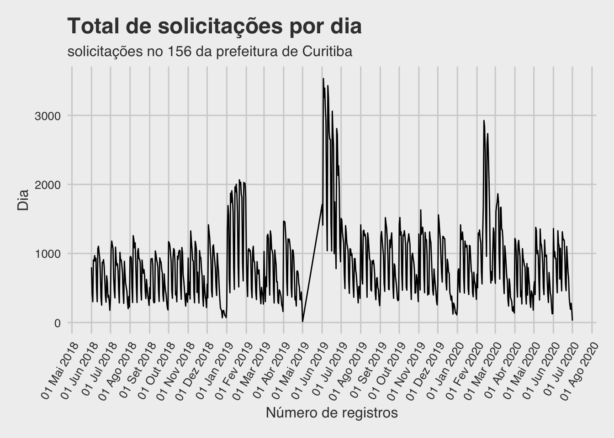

``` r

ggplot(cwb_by_day, aes(x = week, y = total)) + 
  stat_summary(fun = sum, geom = "line") +
  labs(title = "Total de solicitações por semana",
       subtitle = "solicitações no 156 da prefeitura de Curitiba",
       y = "Número de registros",
       x = "Semana") +
  theme_fivethirtyeight() +
  theme(axis.title = element_text(), axis.text.x = element_text(angle = 60, hjust = 1)) +
  scale_x_date(date_breaks = "1 month", date_labels =  "%d %b %Y") 
```

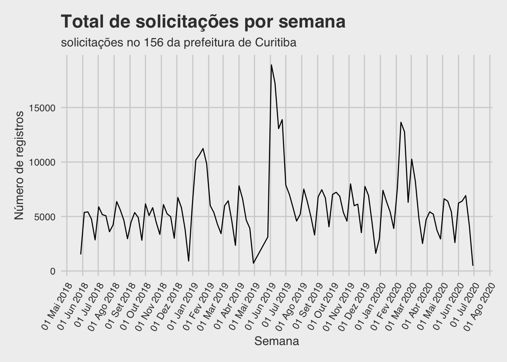

``` r

ggplot(cwb_by_day, aes(x = month, y = total)) + 
  stat_summary(fun = sum, geom = "line") +
  labs(title = "Total de solicitações por mês",
       subtitle = "solicitações no 156 da prefeitura de Curitiba",
       y = "Número de registros",
       x = "Mês") +
  theme_fivethirtyeight() +
  theme(axis.title = element_text(), axis.text.x = element_text(angle = 60, hjust = 1)) +
  scale_x_date(date_breaks = "1 month", date_labels =  "%d %b %Y") 
```

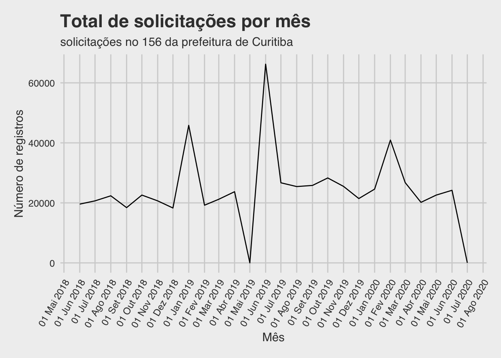

Uma análise dos dados mostra que os atributos mais significativos
aparentam ser:  
\- Unidade Regional, - Órgão Responsável e - Assunto.

Sendo *assunto* uma propriedade com forte correlação com *Órgão
Responsável*, apresentando em alguns casos como uma subdivisão
exclusiva.  
A seguir as informações históricas destes dados.

### Unidade Regional

``` r
cwb_by_ur <- cwb %>% 
  select(datetime, regional_ass) %>% 
  group_by(day = date(datetime), ur = regional_ass) %>% 
  summarise(total = n()) %>% 
  mutate(week = as.Date(cut(day, "week")),
         month = as.Date(cut(day, "month"))) %>% 
  na.omit(ur)

ggplot(cwb_by_ur,aes(x = day, y = total, colour = ur)) + 
  geom_line() +
  labs(title = "Total de solicitações por regional",
       subtitle = "solicitações no 156 da prefeitura de Curitiba",
       x = "Dia",
       y = "Número de solicitações") +
  theme_fivethirtyeight() +
  theme(axis.title = element_text(), 
        axis.text.x = element_text(angle = 60, hjust = 1),
        legend.title = element_blank()) +
  scale_x_date(date_breaks = "1 month", date_labels =  "%d %b %Y") 
```

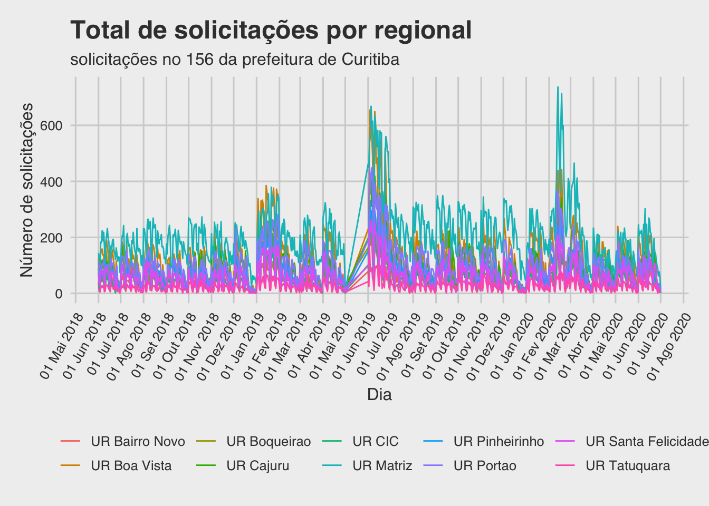

``` r

ggplot(cwb_by_ur,aes(x = week, y = total, colour = ur)) + 
  stat_summary(fun = sum, geom = "line") +
  labs(title = "Total de solicitações por regional",
       subtitle = "solicitações no 156 da prefeitura de Curitiba",
       x = "Semana",
       y = "Número de solicitações") +
  theme_fivethirtyeight() +
  theme(axis.title = element_text(), 
        axis.text.x = element_text(angle = 60, hjust = 1),
        legend.title = element_blank()) +
  scale_x_date(date_breaks = "1 month", date_labels =  "%d %b %Y") 
```

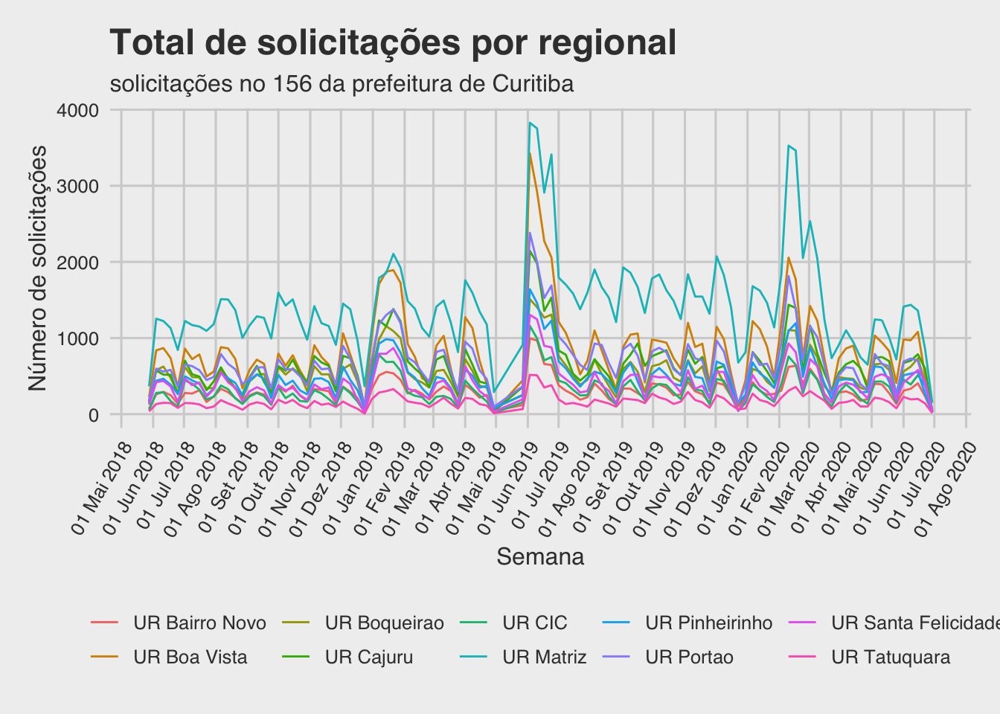

``` r

ggplot(cwb_by_ur,aes(x = month, y = total, colour = ur)) + 
  stat_summary(fun = sum, geom = "line") +
  labs(title = "Total de solicitações por regional por mês",
       subtitle = "solicitações no 156 da prefeitura de Curitiba",
       x = "Mês",
       y = "Número de solicitações") +
  theme_fivethirtyeight() +
  theme(axis.title = element_text(), 
        axis.text.x = element_text(angle = 60, hjust = 1),
        legend.title = element_blank()) +
  scale_x_date(date_breaks = "1 month", date_labels =  "%d %b %Y") 
```

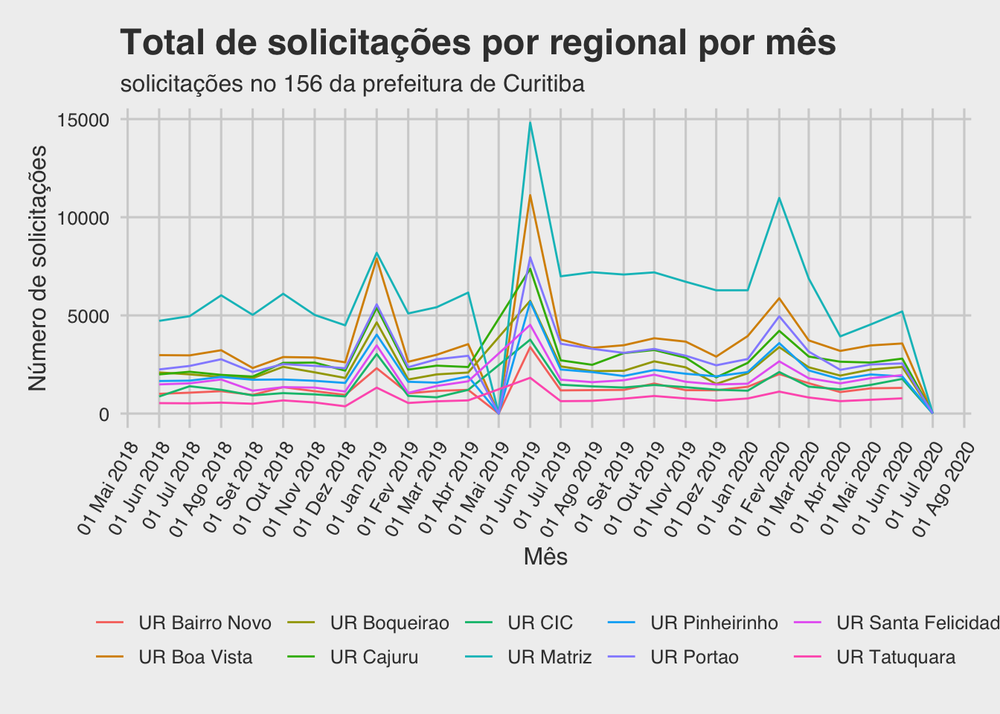

``` r

# por facet:
ggplot(cwb_by_ur,aes(x = day, y = total, colour = ur)) + 
  geom_line() +
  labs(title = "Total de solicitações por regional",
       subtitle = "solicitações no 156 da prefeitura de Curitiba",
       x = "Mês",
       y = "Registros") +
  theme_fivethirtyeight() +
  theme(axis.title = element_blank(), 
        axis.text.x = element_blank(),
        axis.text.y = element_blank(),
        legend.title = element_blank()) +
  facet_grid(~ur)
```

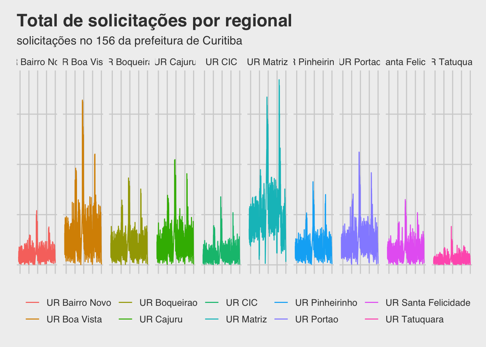

### Número de solicitações por regional proporcional a 1.000 habitantes

Como as regionais possuem populações diferentes, vamos reavaliar
considerando a relação de número de atendimentos dividido por 1.000
habitantes:

``` r
cwb_by_ur_by_pop <- cwb %>% select(ur = regional_ass) %>% 
  group_by(ur) %>% 
  summarise(total = n()) %>% 
  inner_join(y = regional, by = c("ur" = "nome")) %>% 
  mutate(relativo = as.integer(format(round((total/populacao)*1000, digits = 0), nsmall = 0)))

cwb_by_ur_by_pop <- cwb_by_ur_by_pop %>% mutate(ur = fct_reorder(ur, relativo))

ggplot(cwb_by_ur_by_pop, aes(x=relativo, y=ur))+ 
  geom_bar(stat="identity") +
  labs(title = "Curitiba 156",
      subtitle = "Número de solicitações por 1.000 habitantes") +
  ylab(label = "Regional") +
  xlab(label = "Solicitações por 1000 habitantes") +
  geom_text(aes(label = relativo), hjust = -0.2)
```

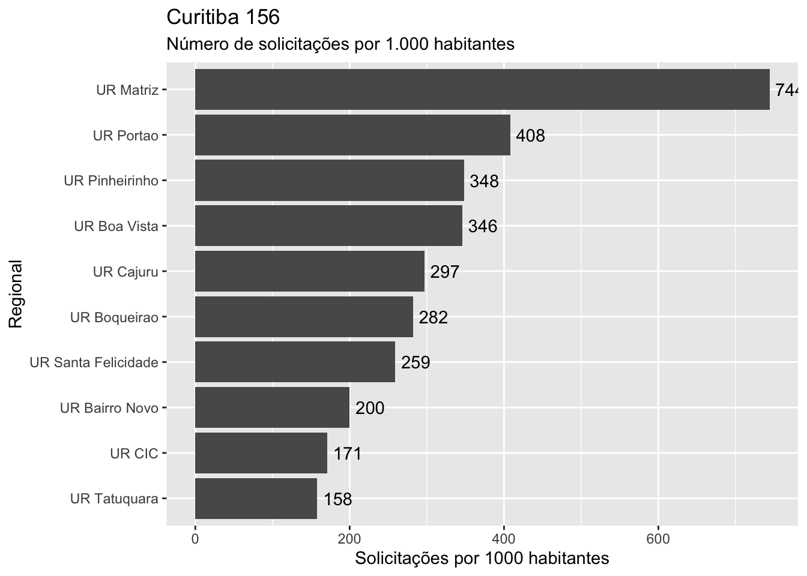

### Órgão Responsável

Vamos filtrar apenas os órgãos responsáveis que receberam mais que 0.5%
dos solicitações registrados.

``` r
# vamos obter a lista dos órgãos que respondem por mais de 90%
# dos solicitações:
principais <- cwb %>% select(orgao_resp) %>% 
  group_by(orgao_resp) %>% 
  summarise(total = n(),perc_total = format(round((total / nrow(.))*100, digits = 2), nsmall = 2)) %>% 
  filter(perc_total > 0.5)

cwb_orgao_resp <- cwb %>% select(data, orgao_resp) %>% 
  group_by(data, orgao_resp) %>% 
  summarise(total = n()) %>% 
  filter(orgao_resp %in% principais$orgao_resp)

ggplot(cwb_orgao_resp,aes(x = data, y = total, colour = orgao_resp)) + 
  geom_line() +
  labs(title = "Total de solicitações por regional",
       subtitle = "solicitações no 156 da prefeitura de Curitiba",
       x = "Mês",
       y = "Registros") +
  theme_fivethirtyeight() +
  theme(axis.title = element_text(), 
        axis.text.x = element_text(angle = 60, hjust = 1),
        legend.title = element_blank(),
        legend.direction = "horizontal") +
  guides(colour = guide_legend(nrow = 5)) +
  scale_x_date(date_breaks = "1 month", date_labels =  "%d %b %Y")
```

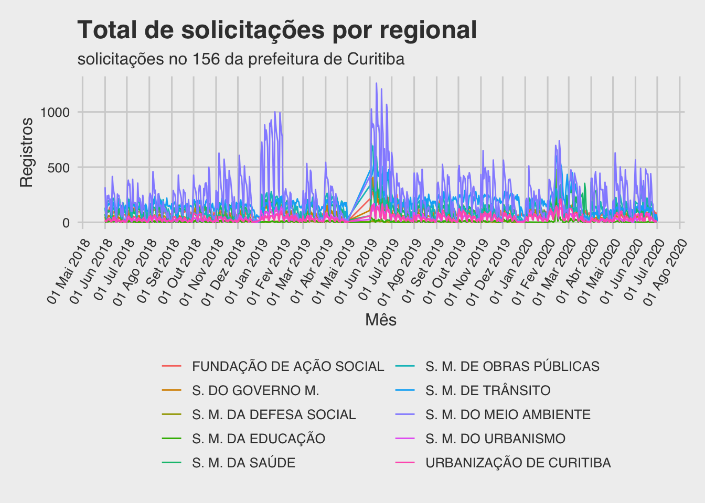

``` r
  
# por facet:
ggplot(cwb_orgao_resp,aes(x = data, y = total, colour = orgao_resp)) + 
  geom_line() +
  labs(title = "Total de solicitações por regional",
       subtitle = "solicitações no 156 da prefeitura de Curitiba",
       x = "",
       y = "") +
  theme_fivethirtyeight() +
  theme(axis.title = element_text(), 
        axis.text.x = element_blank(),
        legend.title = element_blank()) +
  guides(colour = guide_legend(nrow = 4)) +
  facet_grid(~ orgao_resp) 
```

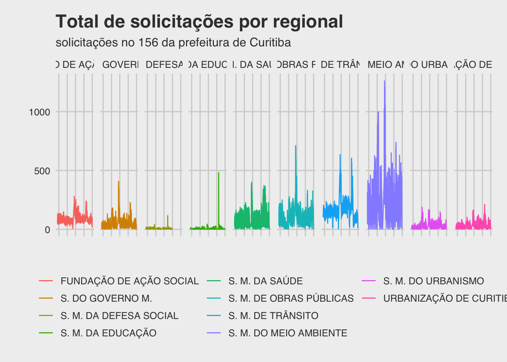

Há uma quantidade muito grande de assuntos cadastrada no sistema. Vamos
filtrar apenas os assuntos cujas chamadas ultrapassam 1% do total:

``` r
cwb_assunto <- cwb %>% select(assunto) %>% 
  group_by(assunto) %>% 
  summarise(total = n()) %>% 
  mutate(relativo = round(total/sum(total)*100,digits = 0)) %>% 
  mutate(assunto = fct_reorder(assunto, total)) %>% 
  filter(relativo > 0)

ggplot(cwb_assunto, aes(x = total, y = assunto)) +
  geom_bar(stat = "identity") +
  labs(title = "Solicitações por Assunto",
       subtitle = "Apenas assuntos com mais de 1% do total de solicitações") +
  ylab(label = "Assunto") +
  xlab(label = "Solicitações") +
  theme(axis.title = element_text(), 
        axis.text.x = element_blank(),
        legend.title = element_blank()) +
  geom_text(aes(label = total), hjust = -0.2)
```

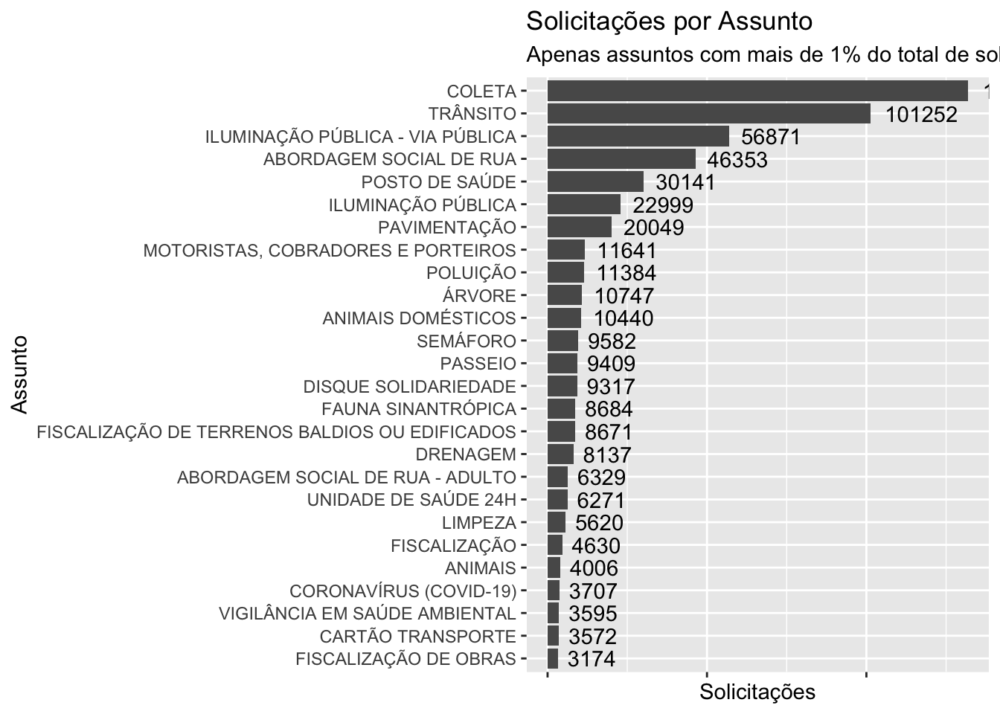

``` r
### Série histórica dos assuntos acima de x% dos solicitações:
cwb_assunto_2 <- cwb_assunto %>% filter(relativo > 2)

cwb_assunto_serie <- cwb %>% select(datetime, assunto) %>% 
  inner_join(cwb_assunto_2) %>% 
  group_by(day = date(datetime), assunto) %>% 
  summarise(total = n()) %>% 
  mutate(week = as.Date(cut(day, "week")), 
         month = as.Date(cut(day, "month")))
  
ggplot(cwb_assunto_serie, aes(x = day, y = total, colour = assunto)) +
  geom_line() +
  labs(title = "Curitiba 156",
       subtitle = "solicitações pelos principais assuntos - série diária",
       x = "Mês",
       y = "Registros") +
  theme_fivethirtyeight() +
  theme(axis.title = element_text(), 
        axis.text.x = element_text(angle = 60, hjust = 1),
        legend.title = element_blank()) +
  guides(colour = guide_legend(nrow = 3)) +
  scale_x_date(date_breaks = "1 month", date_labels =  "%d %b %Y")
```

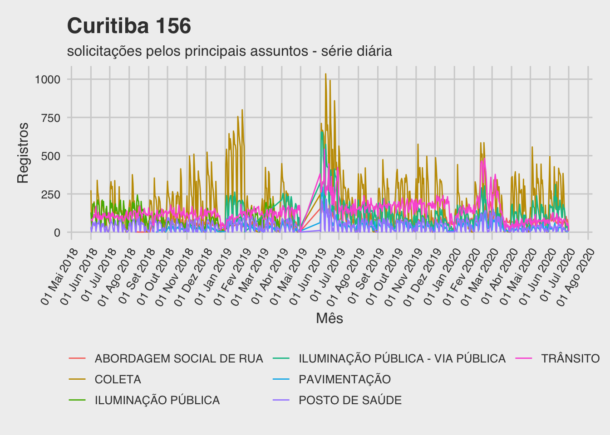

``` r

ggplot(cwb_assunto_serie, aes(x = week, y = total, colour = assunto)) +
  stat_summary(fun = sum, geom = "line") +
  labs(title = "Curitiba 156",
       subtitle = "solicitações pelos principais assuntos - série semanal",
       x = "Mês",
       y = "Registros") +
  theme_fivethirtyeight() +
  theme(axis.title = element_text(), 
        axis.text.x = element_text(angle = 60, hjust = 1),
        legend.title = element_blank()) +
  guides(colour = guide_legend(nrow = 3)) +
  scale_x_date(date_breaks = "1 month", date_labels =  "%d %b %Y")
```

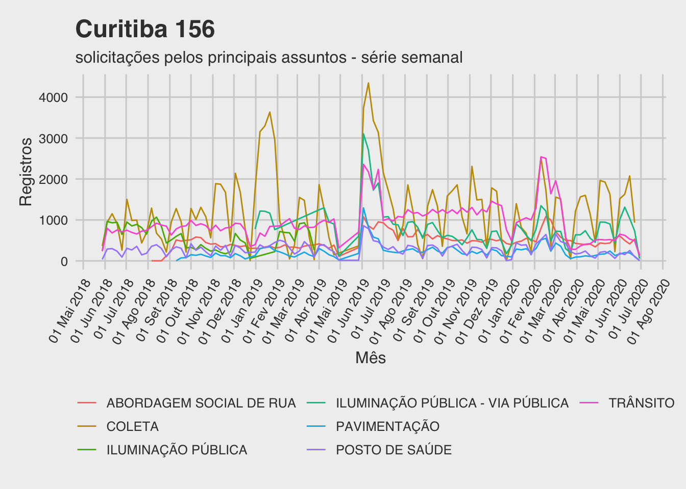

``` r

ggplot(cwb_assunto_serie, aes(x = month, y = total, colour = assunto)) +
  stat_summary(fun = sum, geom = "line") +
  labs(title = "Curitiba 156",
       subtitle = "solicitações pelos principais assuntos - série mensal",
       x = "Mês",
       y = "Registros") +
  theme_fivethirtyeight() +
  theme(axis.title = element_text(), 
        axis.text.x = element_text(angle = 60, hjust = 1),
        legend.title = element_blank()) +
  guides(colour = guide_legend(nrow = 3)) +
  scale_x_date(date_breaks = "1 month", date_labels =  "%d %b %Y")
```

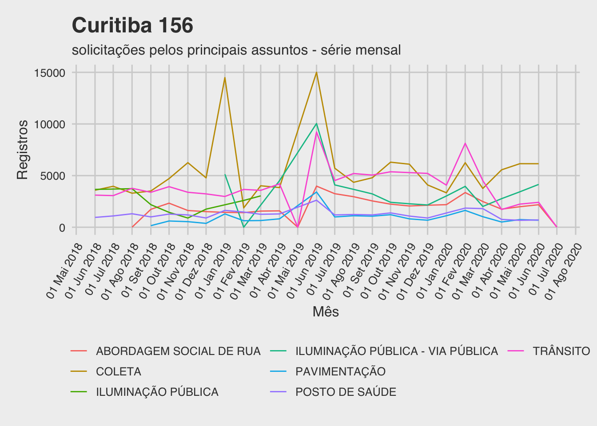

Podemos verificar se existe uma correção entre assunto e órgão
responsável, sendo em vários casos o assunto exclusivo do órgão
responsável.

# Ações realizadas de saneamento dos dados

As seguintes ações de saneamento foram conduzidas antes da importação,
todas elas através da ferramenta *Libre Office*:

1.  Conversão de padrão Western-Europe(Windows1251/Latin1) para UTF-8.  
2.  Modificação do header para minúsculas.  
3.  Exclusão da linha 2 que continha hífens (p.ex.: “——–”).  
4.  Atribuição do nome “texto\_resposta\_final” para a coluna 21, que se
    encontrava sem nome.  
5.  Quando o texto da coluna 21 possuía “line-feeds”, o mesmo gerava uma
    nova linha de registro errada apenas com informações parciais do
    texto da coluna 21 da linha anterior. Estas linhas foram excluídas.
    Como não estaremos analisando o conteúdo dos textos das respostas,
    consideramos o esforço de preservar os mesmos desnecessário para a
    análise proposta aqui. Este problema poderia ter sido evitado com a
    inclusão de aspas envolvendo os campos textos durante a extração dos
    dados (ver ações de saneamento números 6 e 7).  
    Ao invés deste procedimento (5) optou-se por excluir os registros
    com número de solicitação inválido após a carga dos dados,
    otimizando o processo.
6.  Troca de qualquer caracter aspas duplas (") dos campos textos para
    não interferir no passo 7.  
7.  Salvar o arquivo envolvendo os campos texto com aspas para melhor
    controle da importação (permite, por exemplo que campos textos
    tenham o caracter “;”, utilizado para separação dos campos).  
8.  Exportação do arquivo utilizando formato UTF-8, separador “;” e
    campos textos envolvidos por aspas-duplas (").
